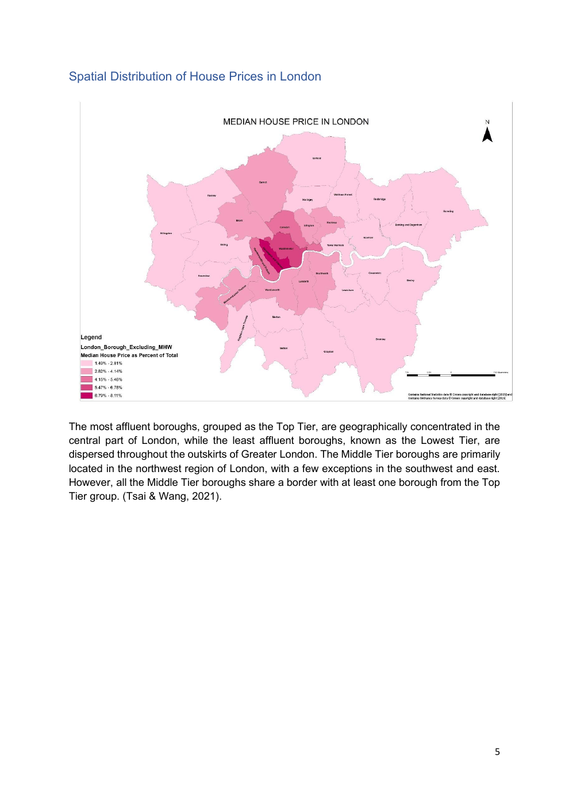

> Reconstructed archive, assembled 2026-09-29. March 2024 author dates are assigned for this edition, not recovered original work timestamps.

# Reading the report map

This image is a rendering of physical PDF page 5, not a regenerated analysis. Original labels and map attribution are preserved. Read the full PDF for the surrounding interpretation.

Before comparing areas, identify the observation unit, legend categories, data period, and mapped variable. A visual pattern is not sufficient to establish a causal explanation or a numerical accuracy claim. The original layers, classifications, and processing settings have not been recovered.

For a later reproduction, save the input provenance and exact settings, recreate this output, and explain differences. Do not substitute a visually similar map while describing it as the original result.
